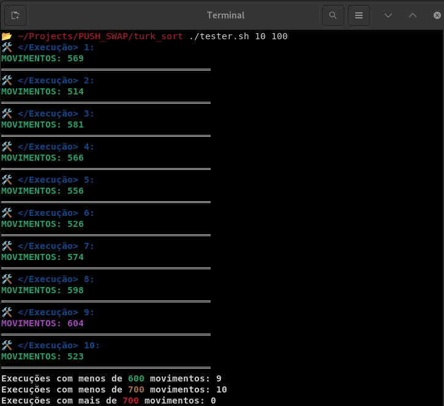
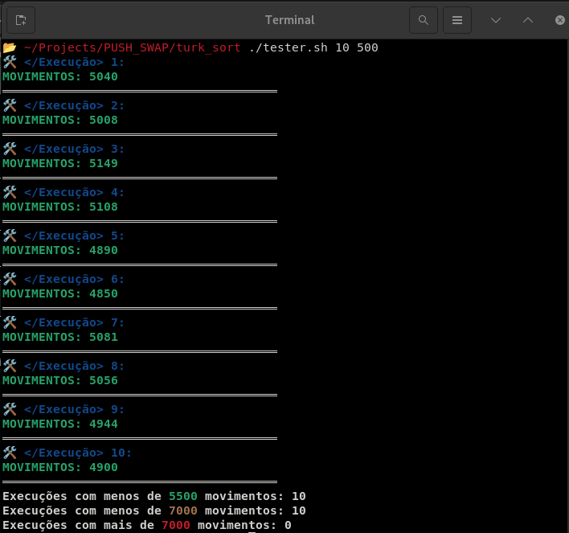

# push_swap

[Leia em Português](README.pt.md)

This project aims to implement an efficient algorithm for sorting an integer stack using a limited set of operations in C.

- **Objective**: Develop a program, `push_swap`, that sorts an integer stack using the smallest possible number of predefined operations. The goal is to implement an efficient sorting algorithm while adhering to the project constraints.

- **Algorithm Used**:
  - The implemented algorithm is **Turk Sort**, which balances efficiency and a reduced number of operations to optimize sorting.
  - **Turk Sort** combines divide-and-conquer techniques, applying intelligent heuristics to minimize the number of required movements in the stack.
  - Implements efficient rotation strategies and intelligent redistribution of elements between `a` and `b`.
  
- **Implemented Features**:  

  | Operation  | Description |
  |------------|--------------------------------------------------------------------------------|
  | `sa`       | Swaps the first two elements of stack `a`                                     |
  | `sb`       | Swaps the first two elements of stack `b`                                     |
  | `ss`       | Executes `sa` and `sb` simultaneously                                        |
  | `pa`       | Moves the top element from `b` to `a`                                        |
  | `pb`       | Moves the top element from `a` to `b`                                        |
  | `ra`       | Rotates `a` (shifts all elements up by one, first element becomes last)      |
  | `rb`       | Rotates `b` (shifts all elements up by one, first element becomes last)      |
  | `rr`       | Executes `ra` and `rb` simultaneously                                       |
  | `rra`      | Reverse rotates `a` (shifts all elements down by one, last element becomes first) |
  | `rrb`      | Reverse rotates `b` (shifts all elements down by one, last element becomes first) |
  | `rrr`      | Executes `rra` and `rrb` simultaneously                                    |


- **Average Moves**:
  - On average, for 100 numbers, `push_swap` performs 550 moves.
  - On average, for 500 numbers, `push_swap` performs 5050 moves.

- **Demonstration Videos**:
  - 

- **push_swap Tester**:
  - A script was created to automatically test the performance and efficiency of `push_swap`.
  - To use the tester, run:
    ```bash
    chmod +x tester.sh
    ./tester.sh <number of executions> <number of numbers>
    ```
  - The script will generate random numbers, execute `push_swap`, and verify the number of operations performed.
 
  - **Testing with 100 and 500 numbers**:
  <table style="border-collapse: collapse; border: none;">
    <tr>
      <td></td>
      <td></td>
    </tr>
  </table>

  ---
  
